# Hospital Web Application
## Overview

Is a responsive fullstack web application that comprise of different features such as Appointment, Room creation, Room reservation, Profiles, Messaging, and Notifications.

## Table of Contents

- [Objective](#objective)
- [Technologies And Tools](#technologies-and-tools)
- [Diagrams](#diagrams)
  - [System Architecture](#system-architecture)
  - [Entity Relationship Diagram](#entity-relationship-diagram)
  - [Cloud Infrastructure](#cloud-infrastructure)
- [Screenshots](#screenshots)
  - [Home Page](#home-page)
  - [Profile](#profile)
  - [Doctor List](#doctor-list)
  - [Appointment](#appointment)
  - [Reservation](#reservation)
  - [Rooms](#rooms)
  - [Messages](#messages)
  - [Notifications](#notifications)

## Objective

- To create a minimum viable product of a web application to be exposed in modern development of applications using modern frameworks and libraries.
- Using cloud services(**Amazon Web Services**) to deploy my application so that I can further expand my knowledge in cloud infrastructure.
- I'll update the project from time to time, to practice good habits and practices. To experiment with Git workflows and commands.

## Technologies And Tools

**Front End**: HTML, CSS, JavaScript, Bootstrap and ReactJS\
**Back End**: Java, Spring Boot and MySQL\
**Cloud Service**: AWS(EC2, RDS and S3)\
**Testing**: JUnit and Mockito

## Diagrams
### System Architecture
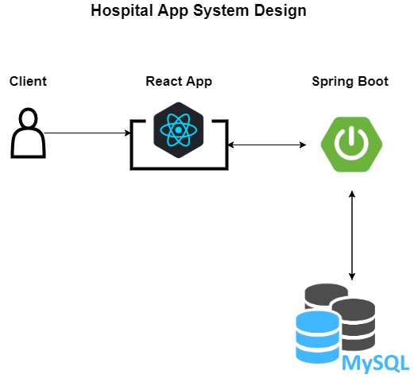

### Entity Relationship Diagram
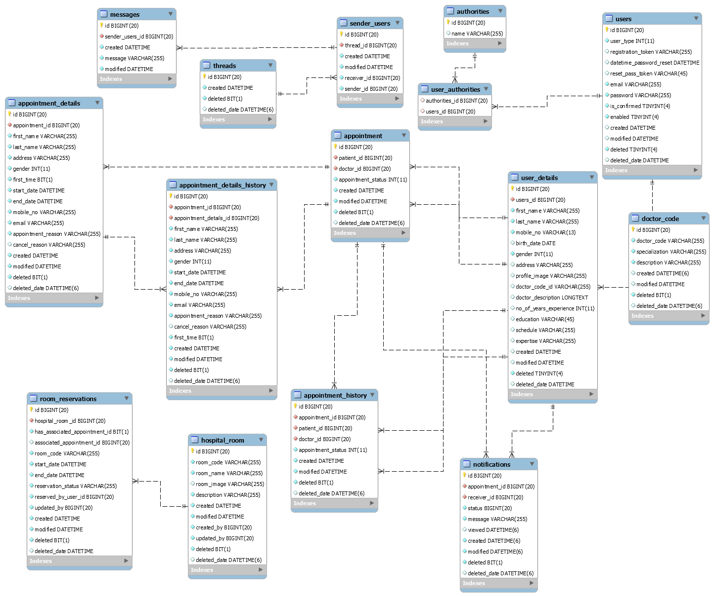

### Cloud Infrastructure
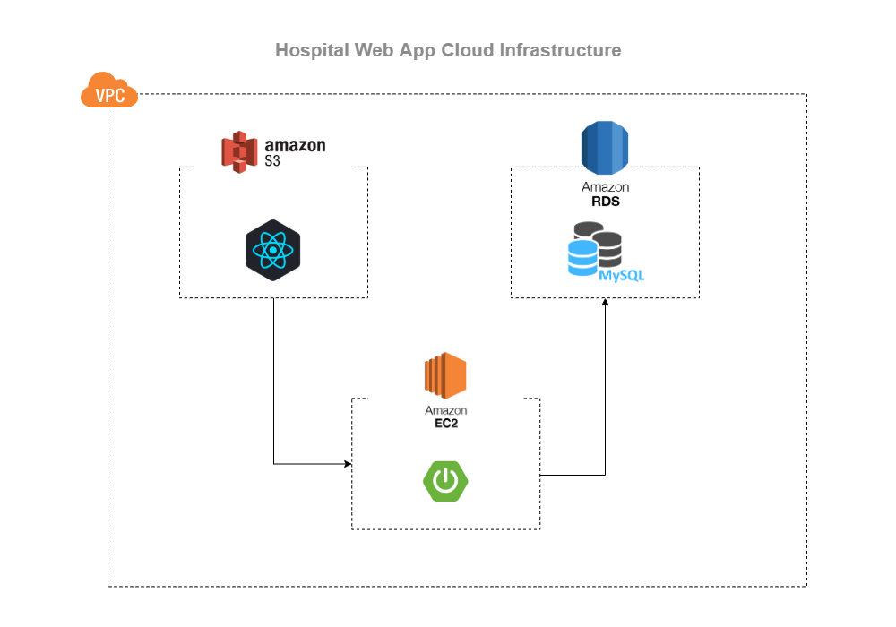

## Screenshots
 - Please note that some images might be distorted and I suggest to view by clicking the image or navigating through the [Screenshots Directory](./img/screenshots)
 to view the image clearly.
 - Left side is desktop view and right is mobile view.
 
### Home Page
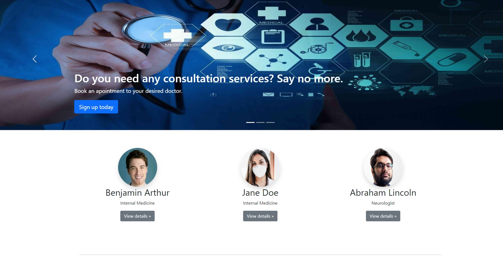 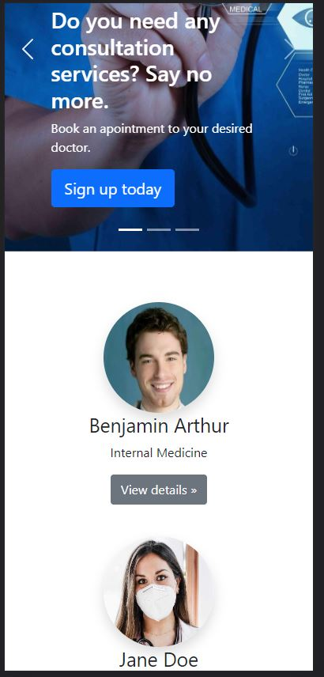

### Profile
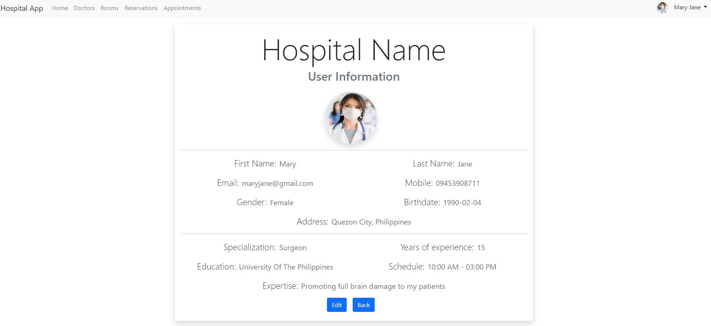 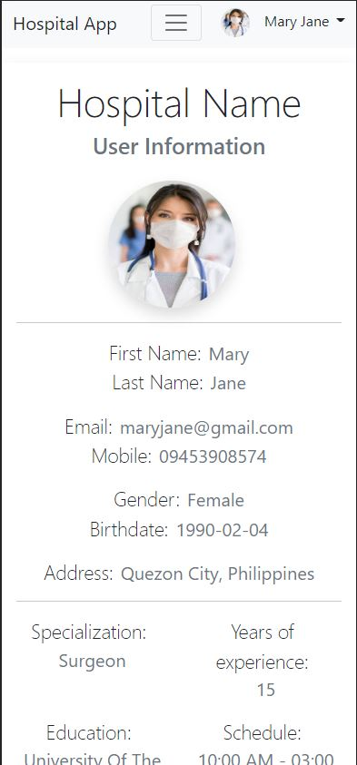

### Doctor List
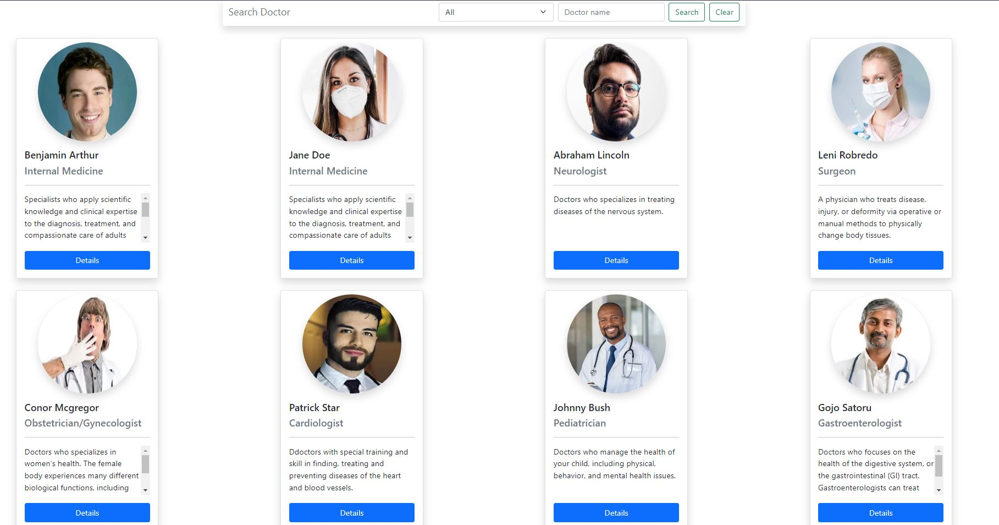 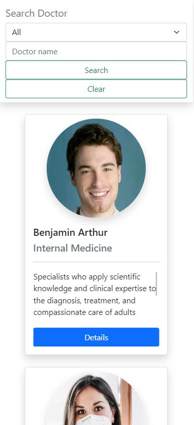

### Appointment
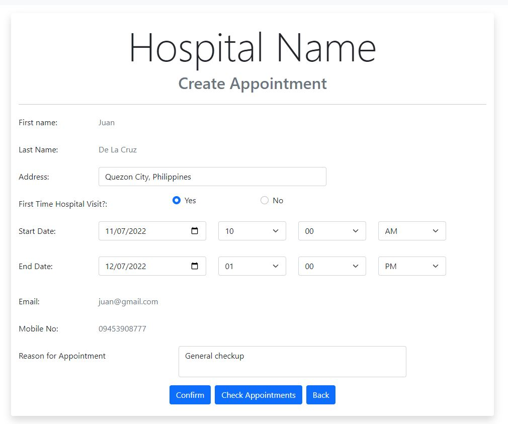 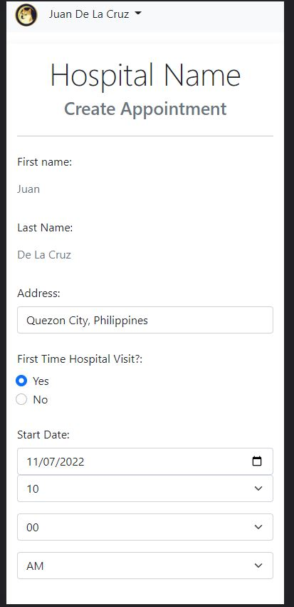

### Reservation
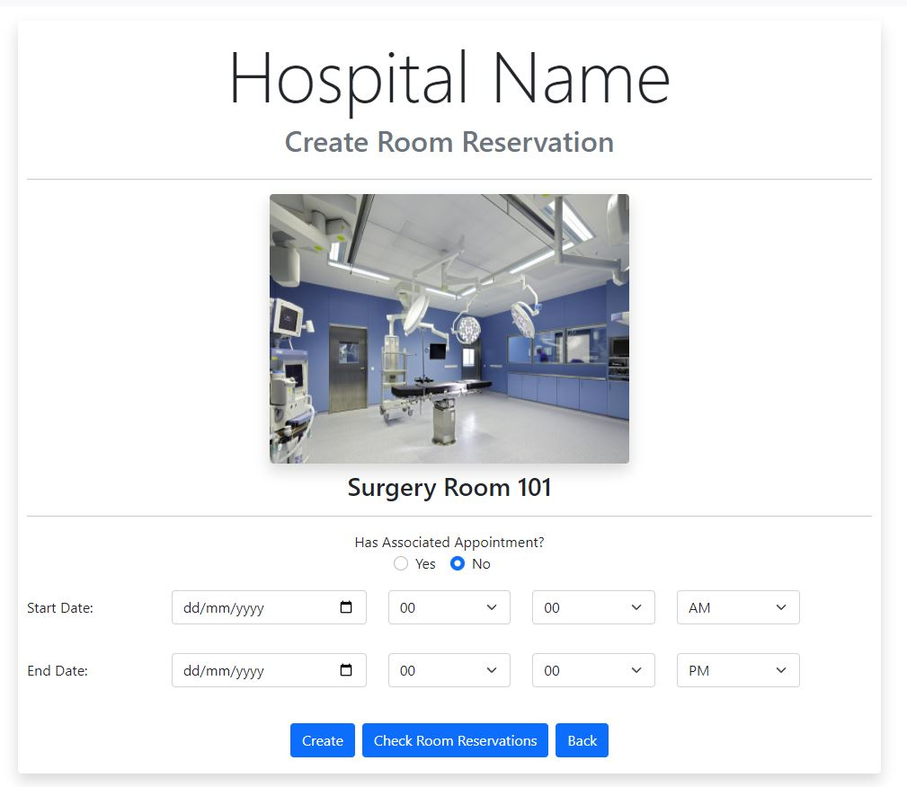 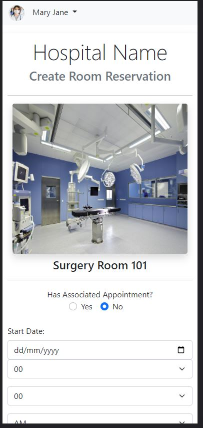

### Rooms
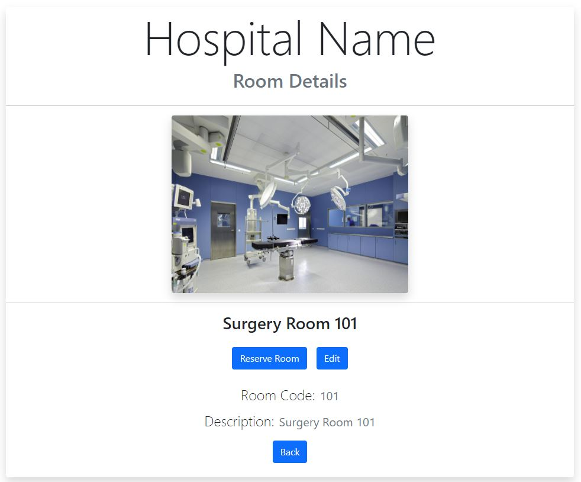 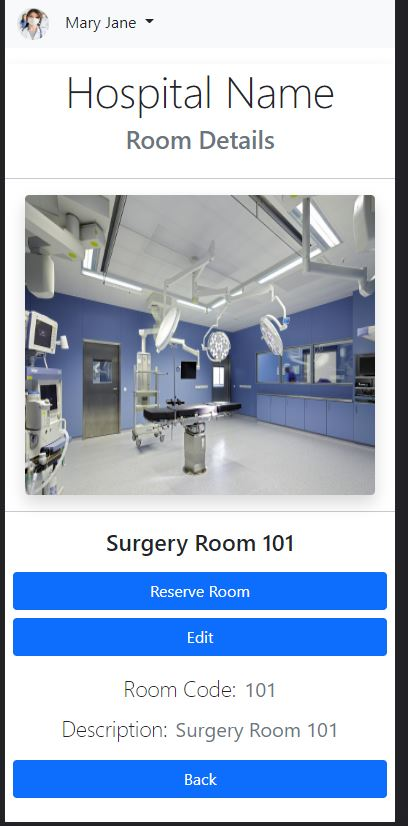

### Messages
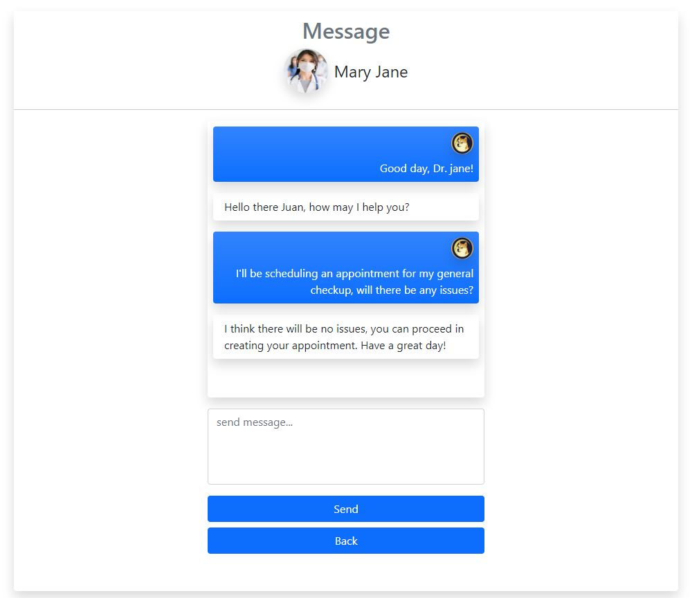 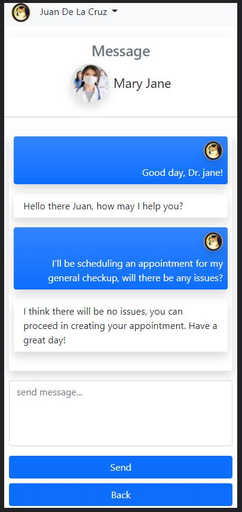

### Notifications
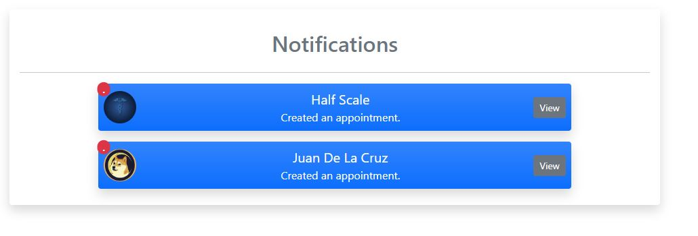 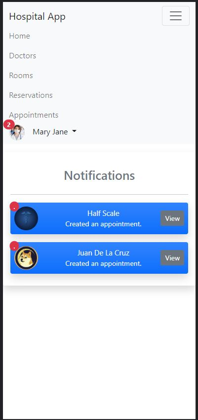
